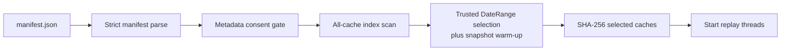

# L2 manifest trust boundary and replay preflight

## Purpose

Manifest-backed L2 replay uses three representations with different roles:

```text
raw lob.csv + trades.csv
  -> canonical daily Parquet for audit and analysis
  -> derived daily replay.l2cache for the C++ runtime
  -> manifest.json as metadata and partition index
```

The runtime reads `replay.l2cache`, not Parquet. Consequently, a syntactically
valid manifest is not sufficient: false counts or time bounds could otherwise
change which cache files a `DateRange` selects while every cache SHA remains
correct. `L2CacheReader` therefore treats the manifest as an untrusted index
until it has reconciled that index with the cache files.

This preflight is an extension implemented for the local L2 pipeline. It is
not required by the original Homework 4 statement, which only asks the engine
to consume market-data messages.

## Entry and ownership

`backtest.run()` detects an L2 input when the JSON object has a format starting
with `cmf-l2-`. The caller thread constructs `L2CacheScheduledSource`, whose
`L2CacheReader` completes all manifest, metadata, cache-index, and selected-hash
checks before `execute_source()` starts the dispatcher and trading threads.



Any failure before `THREADS` raises `L2CacheError` on the calling thread. No
partial replay result is returned.

## Validation phases

### 1. Strict manifest parsing

The reader requires manifest/schema version 1 and rejects missing or unknown
fields, invalid numeric types, unsupported enums, unsafe relative paths,
malformed lowercase SHA-256 values, non-positive instrument metadata, invalid
book depth, and inconsistent verified/unknown semantics.

Schema v1 represents exactly two source streams in stable order:

1. `source_files[0]` is `lob.csv` and its rows become snapshot records;
2. `source_files[1]` is `trades.csv` and its rows become trade records.

The runtime instrument metadata must equal the manifest instrument ID, price
scale, tick size, and contract multiplier.

### 2. Verification and consent

`verified_metadata=true` means provenance and market semantics were supplied
to the converter. If it is false, replay requires:

```python
BacktestConfig(allow_unverified_metadata=True)
```

Passing the manifest path alone is not consent. The result preserves the
decision through `Result.dataset_id` and `Result.verified_metadata`. JSONL
inputs return `None` for both properties because they have no dataset manifest.

### 3. Manifest-to-cache index reconciliation

Before trusting partition bounds, the reader opens every cache listed by the
manifest. It validates the declared file size and numeric cache header, then
walks record headers while skipping fixed-size payloads. The scan computes and
checks:

| Invariant | Runtime check |
|---|---|
| Cache identity | magic, cache version, depth, instrument, scale, tick size, and multiplier match the manifest |
| Physical extent | non-empty declared record count; no truncation or trailing bytes |
| Record classification | snapshot kind has side 0; trade kind has side `Buy` or `Sell` |
| Global chronology | timestamps never regress across or within partitions |
| Global sequence | starts at 1 and increments by exactly 1 across partition boundaries |
| Partition counts | computed snapshot/trade counts equal `snapshot_rows` and `trade_rows` |
| Partition bounds | first/last timestamps and sequences equal all four manifest bounds |
| Partition date | UTC date of both timestamp bounds equals the declared partition date |
| Aggregate counts | cache totals equal the two source row counts and `conversion_stats.rows` |

This phase prevents false manifest bounds from silently excluding real events
or producing an empty replay.

### 4. Date range, warm-up, and selected hashes

Only after index reconciliation may manifest bounds drive partition pruning.
The reader selects partitions intersecting the inclusive `DateRange`. When
needed, it also selects the nearest earlier partition containing a snapshot so
the L2 book can warm before the first strategy-visible event.

SHA-256 is then recomputed for every selected cache, including a selected
warm-up partition. A hash mismatch fails before replay threads start. Hashes
of unrelated, unselected partitions are not a replay gate, although their
cache headers are structurally scanned to establish a trustworthy global
index.

### 5. Streaming replay

The selected caches are reopened and decoded sequentially. Snapshot records
atomically replace the aggregated L2 book; trade records produce typed trade
views. Records before the requested start warm state without strategy
callbacks. In-range events enter the existing deterministic scheduler and use
the same latency, ready-barrier, matching, callback, and result paths as the
JSONL source.

## Error behavior

Representative failures include:

| Condition | Error category |
|---|---|
| False partition count or bounds | `partition index does not match replay cache` |
| False UTC date | `partition date does not match replay cache` |
| False aggregate/source counts | aggregate count mismatch |
| Sequence gap, overlap, or timestamp regression | global chronology/continuity error |
| Wrong cache byte size | trailing/truncated cache error |
| Selected cache content differs from its manifest hash | SHA-256 mismatch |
| Unverified metadata without explicit opt-in | consent error |

Errors are fail-fast. The runtime does not sort, repair, ignore, or replace the
affected data.

## Cost and schema-v1 trade-off

Cache version 1 stores only total record count in its header; it has no trusted
footer containing record-kind counts and exact bounds. Correct pruning
therefore requires one linear metadata scan of all cache record headers before
replay. Payloads are skipped and no order book or Python objects are built.

On the current six-partition, 22,901,679-event local dataset, the bounded
10-second functional smoke took 5.29 seconds after this check versus 1.63
seconds before it on the same development machine. Approximately 3.7 seconds
is fixed preflight cost for that dataset. This favors deterministic correctness
without changing already generated version-1 caches. A future cache version
may add authenticated footer metadata to remove the scan, but that requires an
explicit format-version migration.

## Current limits

The preflight establishes trustworthy runtime selection and counts. It does
not replace the converter's offline Parquet certification or prove economic
metadata such as venue, symbol, tick size, multiplier, and trade-side meaning.

Known lower-priority gaps remain:

- reserved cache record flags are not yet required to be zero at replay;
- replay does not independently enforce tick alignment for every cached price;
- persisted Parquet/cache post-write semantic validation is not yet complete;
- the local real dataset remains correctly marked `verified_metadata=false`.

These limitations do not permit false manifest bounds or counts to alter a
run silently, which is the trust gap closed by the preflight.

## Code and verification map

| Concern | Code or test |
|---|---|
| Manifest parsing and metadata gate | `src/market/L2CacheReader.cpp`, `src/runtime/BacktestRuntime.cpp` |
| Cache index scan and reconciliation | `scan_cache_index()`, `validate_manifest_cache_index()` |
| DateRange and warm-up selection | `select_cache_paths()` |
| Selected SHA verification | `verify_cache_hashes()` |
| Result provenance | `src/results/ResultRecorder.*`, `src/python/bindings.cpp` |
| Adversarial integration coverage | `python/tests/test_l2_pipeline.py` |
| Independent P1 closure | [`03_l2_manifest_index_p1_closure_review.md`](../reviews/03_l2_manifest_index_p1_closure_review.md) |

The focused tests alter counts, timestamps, sequences, dates, source totals,
aggregate totals, hashes, and same-size cache bytes and require the public
`backtest.run()` call to fail.
