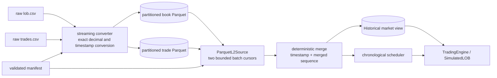

# L2 CSV to Parquet ingestion and replay proposal

## Status

- **State:** implemented on `feat/l2-parquet-data-pipeline` as the explicit
  metadata / native-cache Option B; the local dataset remains unverified until
  its Phase 0 identity and semantics are supplied
- **Prepared and implemented from:** `1ef94a3235e016c8ac16d2b9a673cdbbf9fcc6f2`
- **Repository baseline:** `c4f4c02916f5a9fb5f2636926fd93cd28af0f46d`
- **Affected subsystems:** offline data conversion, market-data ingestion,
  historical market state, runtime source abstraction, configuration,
  packaging, tests, and benchmarks
- **Input under review:** local `data_trades/lob.csv`,
  `data_trades/trades.csv`, and `data_trades/microprice_table.csv`

This document is a continuation brief for integrating the local L2 snapshot
and trade data without pretending that it is order-by-order MBO data. It
defines the proposed schemas, conversion boundaries, runtime flow, validation
rules, unresolved metadata, and an implementation sequence. Accepted behavior
under `docs/hw4/architecture/` remains authoritative until this proposal is
reviewed, implemented, tested, and promoted into those documents.

## 1. Executive decision

Keep the existing Databento-like MBO JSONL reader for compatibility and small
test fixtures. Add a separate L2 source path for the local CSV dataset.

Use the formats at distinct boundaries:

| Boundary | Proposed format | Reason |
|---|---|---|
| Original downloaded data | Immutable CSV files | Preserve source evidence and allow reproducible conversion. |
| Canonical local historical storage | Partitioned Parquet | Typed schema, compression, projection, range pruning, and batch reads. |
| Conversion/run metadata | Small versioned JSON manifest | Human-readable provenance and instrument configuration; not a hot-path format. |
| C++ ingestion boundary | Typed numeric batches/events | No strings, JSON objects, pandas objects, or decimal parsing in matching. |
| Scheduler/trading boundary | Existing typed `ScheduledEvent` / `MarketDelivery` family, extended for honest L2 snapshot semantics | Preserve deterministic scheduling, ready barrier, callbacks, and fill authority. |
| Unit-test input | Small checked-in JSONL and Parquet fixtures | Reviewable deterministic evidence without committing the 1.8 GiB source dataset. |

Parquet is the proposed canonical storage format, not the matching-loop data
structure. A source adapter reads Parquet row groups in bounded batches and
publishes typed events in deterministic order.

## 2. Scope and non-goals

### In scope

- preserve and describe the current MBO JSONL path;
- convert the two chronological CSV streams into typed Parquet partitions;
- retain source-row provenance through conversion and replay;
- represent L2 snapshots as L2 snapshots rather than fabricated L3 changes;
- merge snapshot and trade streams deterministically;
- feed the existing scheduler and trading engine without per-row Python calls;
- support `DateRange`, fixed latency, top-N callbacks, quote/trade crossing,
  positions, PnL, and result recording;
- validate converted data before it is accepted for replay;
- benchmark conversion, storage, scan, and end-to-end replay.

### Explicitly out of scope

- reconstructing real exchange `order_id` values from aggregated depth;
- reconstructing add/cancel/modify chronology or queue position;
- claiming exchange timestamps when only `local_timestamp` is available;
- guessing the venue, symbol, contract multiplier, or trade-side semantics;
- replacing the existing MBO source before compatibility tests exist;
- loading the full dataset into pandas memory;
- sending one Python object or callback per physical input row;
- introducing a database, network service, or generic plugin framework.

## 3. Data layers and terminology

The project must not use “format” to mean both a storage encoding and a market
event model.

| Layer | Meaning | Examples |
|---|---|---|
| Market semantics | What happened in the market | MBO add/cancel/modify, L2 snapshot, trade. |
| Physical encoding | How records are stored | JSONL, CSV, Parquet, Arrow IPC, native binary. |
| Normalized native contract | Typed values used by C++ | `TimestampNs`, `PriceTicks`, `Quantity`, `InstrumentId`, `Side`. |
| Scheduled contract | Causal unit released to the trading thread | Market delivery, new-order arrival, cancel arrival. |
| Strategy callback | Stable public observation | `BookUpdate`, `Trade`, `Fill`, `Reject`. |

MBO is a strong event model for an L3 backtester. JSONL is only one physical
encoding of MBO. The local files have L2 snapshot and trade semantics, so
changing CSV to Parquet does not turn them into MBO.

## 4. Current source inventory

The files are local and ignored by Git. Counts and ranges below were observed
on the prepared commit and must be revalidated by the converter.

| File | Approximate size | Data rows | Observed UTC range if `local_timestamp` is Unix microseconds | Meaning |
|---|---:|---:|---|---|
| `data_trades/lob.csv` | 970 MB | 1,036,690 | 2024-08-01 through 2024-08-06 | Aggregated top-25 snapshots. |
| `data_trades/trades.csv` | 992 MB | 21,864,989 | 2024-08-01 through 2024-08-06 | Trade tape with `buy`/`sell`, price, and amount. |
| `data_trades/microprice_table.csv` | 1 KB | 30 | Not a time series | Derived model lookup table. |

Observed checks, not yet conversion acceptance evidence:

- no timestamp regression when each file is read in source-row order;
- no missing best bid, best ask, bid level 25, or ask level 25;
- no observed locked or crossed best quote;
- both trade sides are present;
- the files do not identify an instrument, symbol, venue, publisher, price
  scale, tick size, multiplier, timezone, or timestamp semantics.

The filesystem shows that the two large files were downloaded through Chrome,
but it does not retain a source URL. That is not sufficient provenance for
publishing or interpreting the dataset.

## 5. Physical source schemas

### 5.1 `lob.csv`

One physical row is one complete aggregated top-25 snapshot.

| Source column | Observed representation | Logical meaning | Proposed normalized type |
|---|---|---|---|
| unnamed first column | integer | source row/index | `uint64 source_row` |
| `local_timestamp` | integer | unresolved local event/receive timestamp in apparent microseconds | `int64 source_timestamp_us` then checked `TimestampNs` |
| `asks[i].price`, `i=0..24` | decimal text parsed by generic readers as floating point | ask price at depth index `i` | exact `PriceTicks` |
| `asks[i].amount`, `i=0..24` | decimal with observed `.0` | aggregate ask quantity at depth index `i` | checked integer `Quantity` |
| `bids[i].price`, `i=0..24` | decimal text parsed by generic readers as floating point | bid price at depth index `i` | exact `PriceTicks` |
| `bids[i].amount`, `i=0..24` | decimal with observed `.0` | aggregate bid quantity at depth index `i` | checked integer `Quantity` |

The converter must not parse source prices through binary floating point. It
must parse decimal characters directly into scaled integer ticks and reject
values that cannot be represented exactly by the configured scale and tick.

### 5.2 `trades.csv`

| Source column | Observed representation | Logical meaning | Proposed normalized type |
|---|---|---|---|
| unnamed first column | integer | source row/index | `uint64 source_row` |
| `local_timestamp` | integer | unresolved local event/receive timestamp in apparent microseconds | `int64 source_timestamp_us` then checked `TimestampNs` |
| `side` | `buy` or `sell` | likely aggressor side; must be confirmed | `Side` encoded as `int8` |
| `price` | decimal text | trade price | exact `PriceTicks` |
| `amount` | positive integer | trade quantity | `Quantity` |

### 5.3 `microprice_table.csv`

| Source column | Proposed type | Meaning |
|---|---|---|
| `imbalance_bucket` | `uint8` | Discrete imbalance bucket. |
| `spread_bucket` | `uint8` | Discrete spread bucket. |
| `imbalance_center` | `float64` | Bucket center used by the derived model. |
| `G_star` | `float64` | Derived microprice adjustment. |

This file is strategy/model configuration. It must not enter the chronological
market source. If used, it should be versioned with the strategy configuration
and record which market-data partition produced it.

## 6. Existing MBO JSONL contract

The current `JsonlReader` consumes one Databento-like MBO object per line.

### Common physical fields

| Current field | Current requirement | Purpose |
|---|---|---|
| `ts_recv` | required UTC ISO-8601 string | Provider receive time. |
| `hd.ts_event` | required UTC ISO-8601 string | Exchange event time and scheduler source time. |
| `hd.instrument_id` | required integer | Per-instrument book routing. |
| `sequence` | required non-negative integer and currently globally increasing | Stable source ordering. |
| `action` | required one-character string | `A`, `C`, `M`, `T`, `F`, or `R`. |
| `flags` | optional syntactically, but an `F_LAST` boundary is operationally required | Atomic group completion. |

### Action-dependent fields

| Action | `side` | `price` | `size` | `order_id` |
|---|---:|---:|---:|---:|
| `A` add | required | required | required | required |
| `M` modify | required | required | required | required |
| `C` cancel | optional | optional | optional | required |
| `F` fill | optional | optional | required | required |
| `T` trade | required | required | required | optional |
| `R` clear | optional | optional | optional | optional |

The written HW4 assignment requires the trading side to receive already
published `BookUpdate`, `BookSnapshot`, and `Trade` messages. It does not
require every source to manufacture MBO rows. Databento JSON/Feather appears
in the original big-picture diagram; MBO JSONL-only ingestion is the adopted
implementation, not a universal assignment requirement.

## 7. Gap matrix

| Required concept | MBO JSONL | `lob.csv` | `trades.csv` | Proposed resolution |
|---|---|---|---|---|
| Physical reader | JSONL | CSV | CSV | Convert CSV to Parquet; add a Parquet L2 source. |
| Instrument identity | `hd.instrument_id` | absent | absent | Required manifest value; never infer from price. |
| Event time | `hd.ts_event` | only `local_timestamp` | only `local_timestamp` | Store the supplied timestamp with explicit provenance; do not label it exchange time until confirmed. |
| Receive time | `ts_recv` | not separately present | not separately present | Nullable in canonical schema; optionally map local time only after semantics are confirmed. |
| Stable sequence | `sequence` | per-file row index | per-file row index | Preserve both source rows; assign a merged sequence using one documented tie policy. |
| Event kind | `action` | implicit snapshot | implicit trade | Represent explicit `L2Snapshot` and `Trade` variants. |
| Atomic boundary | `F_LAST` | one row is naturally atomic | one row is naturally atomic | Adapter publishes one atomic event per row; no synthetic `F_LAST` required. |
| Side | MBO side | encoded by bid/ask columns | `buy`/`sell` | Normalize to stable `Side`; confirm trade-side semantics. |
| Price | decimal string | available | available | Exact decimal-to-ticks conversion. |
| Quantity | per-order/trade size | aggregated per price level | trade amount | Preserve semantics; do not present L2 quantity as an order size. |
| Exchange order ID | available for L3 actions | irrecoverable | not needed for a trade | Not part of the L2 contract. |
| L3 queue chronology | reconstructable | irrecoverable | irrecoverable | Explicitly unsupported for the L2 source. |
| Tick/multiplier metadata | external `InstrumentMeta` | absent | absent | Required manifest plus runtime validation. |

## 8. Proposed storage layout

The raw files remain unchanged. Generated files go under a separate ignored
root and are partitioned by schema version, instrument, and UTC date after the
timestamp interpretation is confirmed.

```text
data_trades/
  lob.csv
  trades.csv
  microprice_table.csv

data_normalized/
  l2_parquet/
    manifest.json
    schema_version=1/
      instrument_id=<id>/
        date=2024-08-01/
          book_snapshots.parquet
          trades.parquet
        date=2024-08-02/
          book_snapshots.parquet
          trades.parquet
```

Generated paths must not replace or modify raw files. Conversion writes a
temporary partition, validates it, and then publishes it by an atomic rename.

## 9. Dataset manifest

The manifest is small control-plane metadata, so JSON is appropriate here. A
run must fail before starting threads if required fields are unknown or
incompatible with the Parquet schema.

### Proposed manifest schema

| Field | Type | Required | Purpose |
|---|---|---:|---|
| `manifest_version` | integer | yes | Version of the manifest contract. |
| `data_schema_version` | integer | yes | Version of Parquet table schemas. |
| `dataset_id` | string | yes | Stable local identity for results and checksums. |
| `source_provider` | string or null | yes | Provider name; `null` until confirmed. |
| `venue` | string or null | yes | Exchange/venue; `null` until confirmed. |
| `symbol` | string or null | yes | Human-readable instrument symbol. |
| `instrument_id` | int64 | yes | Positive stable runtime identity. |
| `timestamp_unit` | enum | yes | Expected source unit, provisionally `us`. |
| `timestamp_semantics` | enum | yes | `exchange`, `receive`, `local_receive`, or `unknown`. |
| `timezone` | string | yes | `UTC` only after Unix timestamp semantics are confirmed. |
| `price_scale` | int64 | yes | Integer ticks per quoted unit. |
| `tick_size_ticks` | int64 | yes | Minimum valid price increment. |
| `contract_multiplier` | int64 | yes | Position/PnL multiplier. |
| `book_depth` | integer | yes | Expected depth, currently 25. |
| `trade_side_semantics` | enum | yes | `aggressor`, `maker`, or `unknown`. |
| `same_timestamp_policy` | enum | yes | Frozen tie-break policy for merging streams. |
| `source_files` | array | yes | Paths, byte sizes, row counts, and cryptographic hashes. |
| `partitions` | array | yes | Date bounds, rows, files, replay-cache byte size, and hashes for generated output. |
| `converter_version` | string | yes | Code/version identity used for generation. |
| `created_at` | string | yes | Audit timestamp; never used in replay ordering. |

Unknown provenance fields may be represented during investigation, but a
production-quality PnL run must require confirmed symbol, price scale, tick
size, multiplier, timestamp semantics, and side semantics. Diagnostic replay
may allow an explicit `allow_unverified_metadata` mode; it must mark results as
unverified rather than silently using defaults.

## 10. Canonical Parquet schemas

### 10.1 Shared conventions

- timestamps are signed `int64` nanoseconds after a checked unit conversion;
- prices are signed `int64` `PriceTicks`, never binary floating point;
- quantities and instrument IDs are signed `int64` to match native contracts;
- sequences and source rows are unsigned `uint64`;
- side uses the public `int8` encoding `Sell=-1`, `None=0`, `Buy=1`;
- null is permitted only where this proposal explicitly allows it;
- all rows inside a physical file are sorted by
  `(event_ts_ns, merged_sequence)`;
- Parquet statistics must be enabled for timestamp and sequence columns;
- compression starts with Zstandard and is benchmarked against alternatives;
- target row-group size is a benchmark parameter, initially 64–128 MiB.

### 10.2 `book_snapshots.parquet`

Logical schema:

| Column | Parquet/logical type | Null | Meaning |
|---|---|---:|---|
| `schema_version` | `uint16` | no | Row schema version. |
| `instrument_id` | `int64` | no | Runtime instrument ID. |
| `event_ts_ns` | `int64` | no | Best available event ordering timestamp. |
| `receive_ts_ns` | `int64` | yes | Separate receive time when known. |
| `merged_sequence` | `uint64` | no | Stable order after merging snapshot and trade sources. |
| `source_row` | `uint64` | no | Original CSV row/index. |
| `depth` | `uint8` | no | Number of valid levels, expected 25. |
| `bid_price_ticks` | fixed-size list of 25 `int64` | no | Bids ordered best to worst. |
| `bid_quantity` | fixed-size list of 25 `int64` | no | Aggregate quantity aligned with bid prices. |
| `ask_price_ticks` | fixed-size list of 25 `int64` | no | Asks ordered best to worst. |
| `ask_quantity` | fixed-size list of 25 `int64` | no | Aggregate quantity aligned with ask prices. |

Schema version 1 uses `4 * book_depth` fixed scalar columns; for the production
top-25 source these are the 100 columns named `bid_price_ticks_00` through
`ask_quantity_24`. Smaller depths are permitted only for fixtures. A long
table with 50 physical
rows per snapshot is rejected as the default because it multiplies row count
and replay overhead without adding information.

### 10.3 `trades.parquet`

| Column | Parquet/logical type | Null | Meaning |
|---|---|---:|---|
| `schema_version` | `uint16` | no | Row schema version. |
| `instrument_id` | `int64` | no | Runtime instrument ID. |
| `event_ts_ns` | `int64` | no | Best available event ordering timestamp. |
| `receive_ts_ns` | `int64` | yes | Separate receive time when known. |
| `merged_sequence` | `uint64` | no | Stable order after merging snapshot and trade sources. |
| `source_row` | `uint64` | no | Original CSV row/index. |
| `side` | `int8` | no | Normalized side; semantic meaning recorded in manifest. |
| `price_ticks` | `int64` | no | Exact normalized trade price. |
| `quantity` | `int64` | no | Positive trade quantity. |

### 10.4 Optional model table

If `microprice_table.csv` is retained as Parquet, store it outside the market
event partitions:

```text
data_normalized/models/microprice/<model_version>/table.parquet
```

Its manifest must include training partition hashes, feature definitions,
bucket boundaries, and code/model version. It is loaded once as strategy
configuration, not replayed chronologically.

## 11. Exact field conversions

| Source | Target | Rule | Failure condition |
|---|---|---|---|
| manifest `instrument_id` | both tables `instrument_id` | Copy one validated positive ID. | Missing, zero, negative, or inconsistent ID. |
| CSV `local_timestamp` | `event_ts_ns` | Checked integer multiplication by 1,000 only after confirming microseconds. | Overflow, non-integer, unknown unit without explicit diagnostic mode. |
| CSV `local_timestamp` | `receive_ts_ns` | Populate only if metadata confirms receive/local-receive semantics; otherwise null. | Contradictory manifest. |
| CSV row index | `source_row` | Preserve exactly. | Duplicate, negative, missing, or non-monotonic source row. |
| merged event order | `merged_sequence` | Assign once from the frozen merge key. | Unresolved tie policy or sequence overflow. |
| CSV decimal price | `*_price_ticks` | Parse decimal characters and scale exactly; do not pass through `double`. | Unrepresentable scale, tick misalignment, non-positive value, overflow. |
| LOB `*.amount` | `*_quantity` | Require exact positive integral value before int64 conversion. | Fractional, zero/negative, null, or overflow. |
| trade `amount` | `quantity` | Require positive int64. | Non-positive, null, or overflow. |
| trade `buy` | `Side::Buy` | Apply only after side semantics are confirmed or explicitly marked unverified. | Unsupported token. |
| trade `sell` | `Side::Sell` | Apply only after side semantics are confirmed or explicitly marked unverified. | Unsupported token. |
| LOB bid columns | bid arrays | Preserve source depth order and validate strictly descending prices. | Duplicate/out-of-order level unless a documented normalization rule is accepted. |
| LOB ask columns | ask arrays | Preserve source depth order and validate strictly ascending prices. | Duplicate/out-of-order level unless a documented normalization rule is accepted. |

## 12. Merge and causality contract

The two CSV files have independent row indices and only one apparent timestamp.
They do not provide a shared exchange sequence. Therefore exact cross-stream
causality at identical timestamps cannot be recovered.

The converter must retain:

```text
(event_ts_ns, source_kind, source_row)
```

and assign `merged_sequence` from an explicitly accepted total order:

```text
(event_ts_ns, same_timestamp_priority(source_kind), source_row)
```

The priority between `L2Snapshot` and `Trade` is intentionally unresolved in
this proposal. Picking snapshot-first or trade-first may change which signal
fills a resting order. Tomorrow's design review must either establish source
semantics from provenance or accept and document a deterministic modeling
choice. The converter must not hide this choice inside implementation code.

After conversion, `merged_sequence` is immutable and reused by every replay.
The runtime must not reorder equal-time rows based on thread timing, Parquet
row-group layout, or asynchronous prefetch completion.

## 13. Proposed runtime flow



Replay behavior:

1. validate manifest and configuration;
2. reconcile every schema-v1 cache's counts, exact bounds, UTC date, and
   global sequence continuity with the manifest before trusting its index;
3. select only partitions intersecting `DateRange` and verify their hashes;
4. open one bounded cursor for snapshots and one for trades;
5. decode numeric columns in record batches outside the matching logic;
6. merge the next rows using the stored deterministic key;
7. warm historical state for rows strictly before the requested start;
8. on an L2 snapshot, atomically replace that instrument's historical L2
   levels and produce one final best-quote signal;
9. on a trade, produce one trade price-cross signal and public trade view;
10. schedule the resulting delivery using the existing latency and priority
   rules;
11. keep historical state stable until the trading thread acknowledges the
    delivery through `processed_seq`;
12. reuse batch buffers only after their published views are no longer live.

An L2 snapshot must not generate 50 intermediate quote signals. Its public and
matching semantics are one atomic replacement with one final best bid/ask.

## 14. Proposed native source boundary

The first implementation should introduce a narrow source abstraction rather
than a generic plugin framework. Conceptually:

```cpp
class HistoricalSource {
public:
  virtual ~HistoricalSource() = default;
  virtual bool next(ScheduledEvent &event) = 0;
  virtual void prepare_for_dispatch(ScheduledEvent &event) = 0;
};
```

Alternatively, compile-time composition may avoid a virtual call. The decision
must preserve one source operation per high-level event and must not put a
format switch in the matching loop.

Input semantic variants:

```cpp
using HistoricalInput =
    std::variant<MboEvent, L2SnapshotEvent, TradeEvent>;
```

Shared numeric identity:

```cpp
struct SourceIdentity {
  InstrumentId instrument_id;
  TimestampNs event_ts_ns;
  std::optional<TimestampNs> receive_ts_ns;
  Sequence source_sequence;
};
```

`L2SnapshotEvent` owns or safely views ordered bid/ask levels for one atomic
source event. `TradeEvent` contains side, price, and quantity. Neither requires
an exchange order ID. The implementation must specify buffer ownership and
lifetime through `processed_seq` before exposing spans.

## 15. Historical state and matching semantics

The existing historical store is L3 and applies MBO actions. The L2 path needs
one of these explicitly reviewed implementations:

1. add a dedicated per-instrument `HistoricalL2Book` with atomic snapshot
   replacement; or
2. generalize the read-only trading-facing historical view while retaining
   separate L3 and L2 state owners.

Do not implement L2 snapshots as `Clear + 50 synthetic Add` operations by
default. That representation fabricates order identities, creates intermediate
best-quote transitions that never existed in the source, expands the event
count, and can change fills.

The trading-facing minimum is:

```text
best_bid(instrument_id)
best_ask(instrument_id)
top_n(instrument_id, depth)
last_book_source_sequence(instrument_id)
```

This is sufficient for the current full-fill-on-price-cross model because that
model does not use historical size, queue position, or market impact. L2 runs
must be labeled as optimistic snapshot-based simulations and must not claim L3
execution fidelity.

## 16. Conversion process

The existing `scripts/csv2feather.py` is not suitable because it loads an
entire CSV into pandas, relies on inferred types, does not attach instrument
metadata, and does not validate a generated dataset.

The replacement converter must be streaming and restartable:

1. read and validate the manifest;
2. hash raw source files without modifying them;
3. inspect headers and reject schema drift;
4. scan source rows in bounded batches;
5. parse timestamps and decimal prices exactly;
6. validate each source stream independently;
7. perform the frozen chronological merge and assign `merged_sequence`;
8. write date/instrument Parquet partitions to temporary paths;
9. close and reopen every generated partition;
10. validate schema, counts, bounds, ordering, book invariants, and hashes;
11. write partition metadata and conversion statistics;
12. atomically publish the completed partition;
13. write the final manifest only after every partition passes validation.

Python may be used for the offline converter, but conversion must operate in
batches and must never call into the engine row by row. Candidate conversion
engines are PyArrow or DuckDB. The runtime reader decision is separate and may
use Arrow C++ or a generated engine-native replay cache if Arrow packaging is
too heavy.

## 17. Validation and failure policy

### Source validation

| ID | Required check |
|---|---|
| `L2D-VAL-01` | Exact source headers match the declared schema. |
| `L2D-VAL-02` | Source row IDs are present, unique, non-negative, and strictly increasing within each file. |
| `L2D-VAL-03` | Timestamps are valid integers, do not regress within a source, and convert to nanoseconds without overflow. |
| `L2D-VAL-04` | All prices are positive, exactly representable, and tick aligned. |
| `L2D-VAL-05` | All quantities are positive integral int64 values. |
| `L2D-VAL-06` | Bid prices are strictly descending and ask prices strictly ascending in every snapshot. |
| `L2D-VAL-07` | Best bid is strictly below best ask unless a separately accepted locked-market policy exists. |
| `L2D-VAL-08` | Trade side contains only accepted tokens. |
| `L2D-VAL-09` | The same-timestamp merge policy is present in the manifest and produces a strict total order. |
| `L2D-VAL-10` | Manifest metadata is complete for the requested run mode. |

### Converted-data validation

| ID | Required check |
|---|---|
| `L2D-VAL-11` | Parquet schemas and schema versions match the manifest. |
| `L2D-VAL-12` | Per-partition row counts equal conversion counts. |
| `L2D-VAL-13` | Partition timestamp bounds match file statistics and directory date. |
| `L2D-VAL-14` | `(event_ts_ns, merged_sequence)` is strictly ordered across row-group and file boundaries. |
| `L2D-VAL-15` | Raw-to-Parquet sampled rows are value-equivalent after documented normalization. |
| `L2D-VAL-16` | Full source and generated-file hashes are recorded. |
| `L2D-VAL-17` | A failed or interrupted conversion exposes no apparently complete partition. |

Malformed or contradictory data fails conversion or replay with file,
partition, row, column, and value context. No silent sorting, precision loss,
default instrument metadata, or skipped malformed row is allowed.

## 18. Test plan

### Converter tests

- exact decimal-to-ticks conversion at valid and invalid precision;
- timestamp unit conversion and overflow;
- fractional, zero, negative, and overflowing quantities;
- missing/reordered columns;
- depth ordering, missing levels, locked/crossed books;
- unexpected trade side;
- duplicate and regressing source rows/timestamps;
- equal-time merge for both source kinds;
- partition boundary at midnight;
- interrupted conversion and atomic publication;
- manifest/schema mismatch;
- deterministic hashes and byte-equivalent normalized values.

### Runtime tests

- L2 snapshot warm-up without callbacks;
- first in-range snapshot callback;
- trade-only callback without a false book update;
- immediate arrival-time quote cross against current L2 touch;
- later snapshot quote cross of a resting order;
- later trade cross of a resting order;
- same-timestamp snapshot/trade behavior under the accepted tie policy;
- market-before-new-order-before-cancel scheduler priority;
- multi-instrument isolation;
- date-range partition pruning;
- callback exception shutdown and buffer lifetime;
- 20-run deterministic equality;
- equivalence between a tiny logical L2 fixture and its CSV/Parquet forms.

### Compatibility tests

- all existing MBO JSONL tests remain unchanged and pass;
- public result schemas remain unchanged unless separately approved;
- existing Python strategies do not need to know the physical input format;
- unsupported extensions and schema versions fail before starting runtime
  threads.

## 19. Benchmark plan

Measure on at least one full day and on the complete six-day dataset:

| Benchmark | Required measurements |
|---|---|
| Conversion | Rows/s, input MB/s, output MB/s, wall time, peak RSS. |
| Storage | CSV bytes versus Parquet bytes by table and partition. |
| Cold scan | Time to first event, rows/s, decompression CPU, peak RSS. |
| Warm scan | Rows/s and events/s after filesystem cache warm-up. |
| Range selection | One-hour and one-day startup/read cost. |
| Full replay | Market events/s through scheduler, engine, callbacks, and acknowledgements. |
| Format comparison | JSONL MBO fixture, CSV prototype, and Parquet adapter where semantics permit comparison. |
| Row-group tuning | At least two row-group sizes and compression settings. |

Do not report only Parquet scan throughput. The relevant result is complete
deterministic replay throughput and memory usage. Parsing, scan, matching,
callbacks, and result construction should be reported separately where
possible.

## 20. Dependency decision

The repository currently has no Arrow/Parquet C++ dependency, and the Python
project declares pandas but not PyArrow. Two implementation paths remain:

### Option A — direct C++ Parquet source

```text
Parquet -> Arrow C++ record batches -> typed L2 source -> scheduler
```

Advantages: one canonical persisted format, no Python during replay, batch
decoding, projection and row-group pruning.

Costs: larger native dependency, CMake discovery, cross-platform wheel
packaging, sanitizer compatibility, and longer builds.

### Option B — Parquet plus native replay cache

```text
CSV -> canonical Parquet -> versioned compact binary replay cache -> C++ source
```

Advantages: Parquet remains the analysis/audit store while the hot reader stays
small, numeric, and potentially memory-mapped.

Costs: another derived format and converter stage, cache invalidation, and an
additional schema/version contract.

Option B is implemented. It keeps Arrow C++ out of the build and wheel while
preserving Parquet as the canonical typed audit/analysis store. The converter
writes a versioned little-endian replay cache beside every daily partition;
`L2CacheReader` validates numeric headers and chronology and feeds the native
scheduler without Python row calls. The manifest hashes every generated file;
runtime reconciles every cache's counts, exact bounds, UTC date, and global
sequence continuity before range pruning, then recomputes SHA-256 for selected
cache files before starting replay threads.

## 21. Proposed implementation phases

### Phase 0 — resolve data identity

- identify provider, venue, symbol, market type, and license;
- confirm timestamp unit and semantics;
- confirm whether trade side is aggressor or maker;
- confirm price scale, true tick size, quantity unit, quote currency, and
  contract multiplier;
- choose and document equal-time snapshot/trade ordering.

### Phase 1 — freeze schemas and fixtures

- accept manifest schema version 1;
- choose fixed-size-list versus wide snapshot columns;
- choose direct Arrow C++ versus native cache path;
- create tiny CSV and expected normalized fixtures;
- assign requirement IDs to implementation tasks.

### Phase 2 — build and validate converter

- implement bounded streaming conversion;
- create daily partitions and manifest hashes;
- run full validation against the six-day dataset;
- record size, time, and peak-memory results.

### Phase 3 — introduce source boundary and L2 historical state

- extract current JSONL source behind the narrow source contract;
- implement snapshot replacement without fabricated L3 events;
- preserve barrier, scheduling, exceptions, and buffer lifetimes;
- add focused native tests.

### Phase 4 — implement Parquet/native reader

- add partition selection and bounded batch cursors;
- merge streams by stored sequence;
- integrate with `run_backtest()` and Python configuration;
- add runtime, determinism, and compatibility tests.

### Phase 5 — benchmark and document accepted behavior

- run conversion and replay benchmarks;
- run clean Release, Python, sanitizer, and adversarial QA suites;
- promote accepted decisions into architecture, API, getting-started, and
  traceability documents;
- retain this proposal as the design history.

## 22. Decisions required at the next session

The next integration session should start by answering these in order:

1. What instrument, venue, market type, and provider produced the files?
2. Is `local_timestamp` Unix microseconds, and is it exchange, provider
   receive, or local capture time?
3. Does trade `side` mean aggressor side?
4. What are `price_scale`, tick size, amount unit, and multiplier?
5. What deterministic order should apply when snapshot and trade timestamps
   are equal?
6. **Resolved:** schema version 1 uses 100 scalar depth columns.
7. **Resolved:** runtime consumes a native cache generated beside canonical
   Parquet; Arrow C++ is not a runtime dependency.
8. Should unverified metadata prohibit all runs or permit explicitly labeled
   diagnostic runs?
9. What result metadata must expose dataset ID, schema version, and verification
   status?

No production implementation should begin by guessing answers 1–5. Work that
does not depend on those answers may begin with converter interfaces, invalid
fixtures, and build feasibility experiments in an isolated branch/worktree.

## 23. Acceptance criteria

The proposal is ready to become architecture only when:

- provenance and instrument metadata are resolved or explicitly scoped as an
  accepted diagnostic limitation;
- the schemas and equal-time ordering rule are frozen;
- raw CSV remains unchanged and its hashes are recorded;
- conversion is bounded-memory, exact, deterministic, and restart-safe;
- every generated partition passes the validation matrix;
- L2 snapshots remain semantically L2 throughout replay;
- no per-row Python or JSON work occurs in matching/event loops;
- existing MBO behavior and public results remain compatible;
- clean builds, tests, deterministic repetitions, and relevant sanitizers pass;
- an independent QA agent executes adversarial converter and replay tests;
- benchmarks report storage, conversion, scan, full replay, and memory results;
- architecture, public API, getting-started, and traceability documents are
  updated with the accepted implementation.

## 24. Risks and unsupported interpretations

- Parquet improves storage and scan efficiency but cannot recover missing L3
  information.
- A wrong timestamp interpretation invalidates latency and causal conclusions.
- A wrong trade-side interpretation affects strategy features even though the
  current price-cross matcher ignores aggressor side.
- A guessed multiplier produces numerically plausible but incorrect PnL.
- Separate files make equal-time cross-stream order unknowable without source
  metadata; any tie rule is a model decision.
- L2 snapshots sampled less frequently than underlying market changes can miss
  transient crosses.
- Full-fill-on-cross remains optimistic and ignores displayed quantities,
  queue position, market impact, and slippage.
- Adding Arrow C++ may cost more build and packaging complexity than its replay
  benefit for this homework; this must be measured rather than assumed.

## 25. Continuation checklist

At the start of the next session:

```text
[ ] Confirm working commit/branch and preserve the user's .gitignore change.
[ ] Re-read this proposal and accepted architecture documents.
[ ] Resolve or explicitly defer the Phase 0 metadata questions.
[ ] Record SHA-256, byte size, header, row count, and timestamp bounds for raw files.
[ ] Freeze the same-timestamp merge key.
[ ] Choose snapshot physical schema and runtime Parquet dependency path.
[ ] Create a focused task brief before editing production code.
[ ] Work in a separate branch/worktree for converter and runtime changes.
[ ] Add tests before converting the full dataset.
[ ] Do not claim merge readiness before independent QA and review.
```
